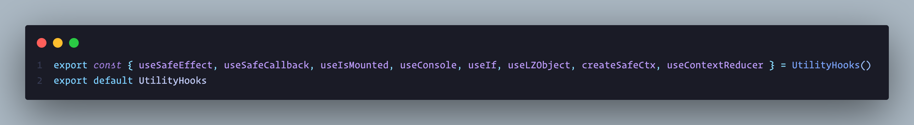

# bresnow_utility-react-hooks

Custom react hooks I have built and use regularly.



```terminal
yarn add bresnow_utility-react-hooks
```

## useConsole

  Hook to use console.log only if NODE_ENV === 'development'.
  Naming the function to something shorter like "_" is a good idea for speed and when removing from the code...
  _.assert, _.info, _.log, _.warn, and _.error have a ```trace()``` method to print the location in code.

```javascript
  import { useConsole } from "bresnow_utility-react-hooks";

  const _ = useConsole();

  _.log("Hello World").trace();
```

## useIf

 If statement hook that returns statement if condition is true. Useful when a normal if statement is causing infinite render errors. Conditions are listed as an array dependencies and eliminates the need for && operators.
 Optional else callback parameter to run when condition is false. **Note: else option runs on every render the conditions !== true.**

 ```javascript  
 {else: ()=>void }
 ```

```javascript
import { useIf } from "bresnow_utility-react-hooks";

 useIf( [auth.keys, auth.isLoggedIn === true ],
  () => {

  nodepathSet(`~${auth.keys?.pub}.${path}`);

  }, { else: 
  () => {

      log("condition is still not true");

  }});

  log(nodepath, "nodepath");   
  //  ['~YQus5nDLVi5PG5BJXGTLoizIWbnrNN9NRER3-0RbqV0.eaV67IswAG3zCf5C5qqR7mF7EwgfmqIsjgf1MDhSNPA.pages.index', 'nodepath']
```

## useContextReducer

Create contexts and providers as if using "useReducer".

``` javascript
const initialState = {
  hidden: true,
  cartItems: [],
  address: null,
};

  function cartReducer(state: State, action: Action): State {
  console.log(state, 'context state');

  switch (action.type) {
    case 'ADD_ITEM':
      return {
        ...state,
        cartItems: addItemToCart(state.cartItems, action.payload),
      };
    case 'CLEAR_CART':
      return {
        ...state,
        cartItems: [],
      };
    default: {
       throw new Error(`Unhandled action type: ${action.type}`);
     }
  }
  

  const [useCartState, useCartDispatch, CartProvider] = useContextReducer(
  cartReducer,
  initialState
);
```

## useSafeEffect

runs useEffect when window is undefined and useLayoutEffect when window is not undefined.

## useSafeCallback

useCallback that runs only when mounted and takes no dependencies.

## useSafeReducer

useReducer but the dispatch runs only when mounted.
